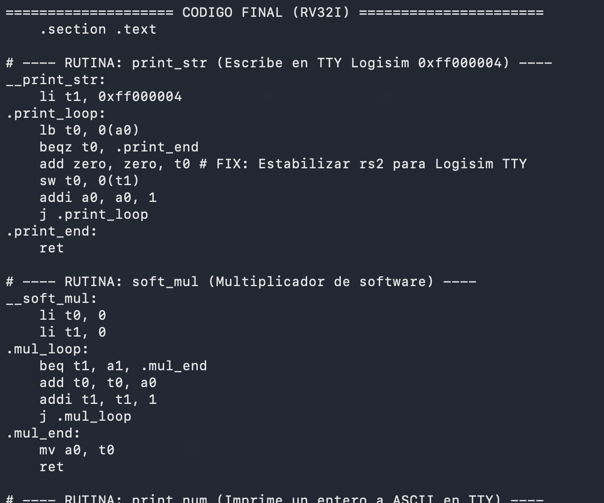
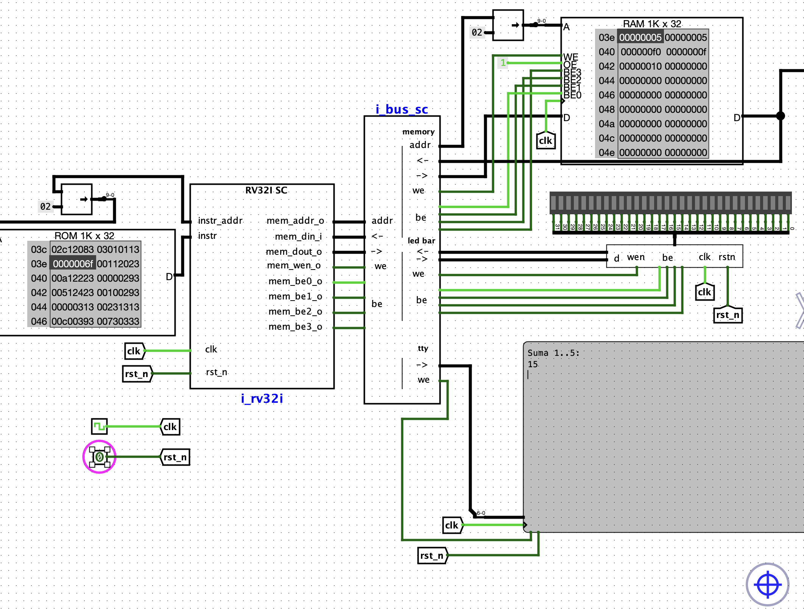
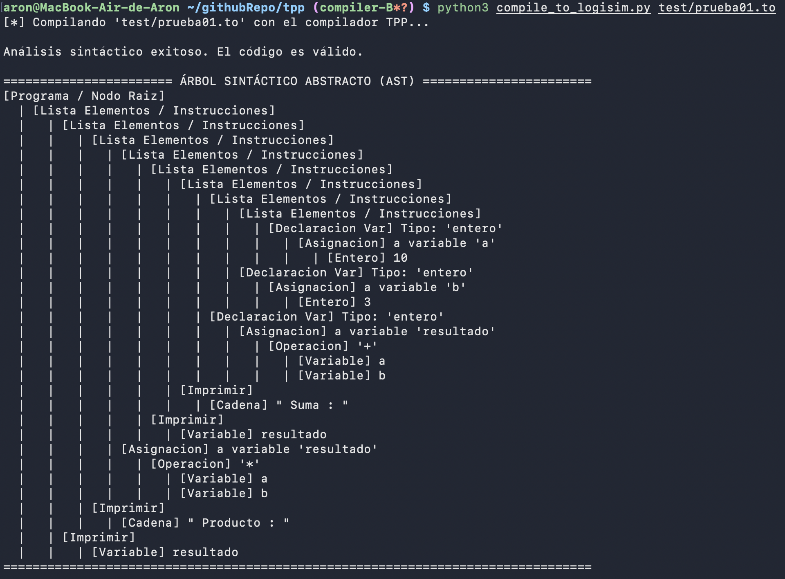
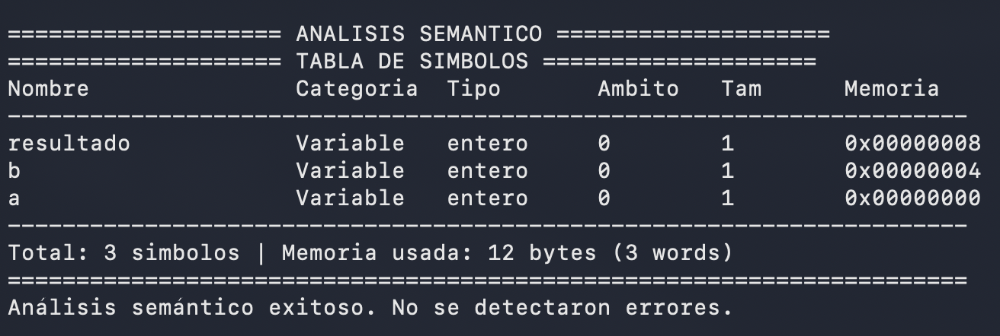
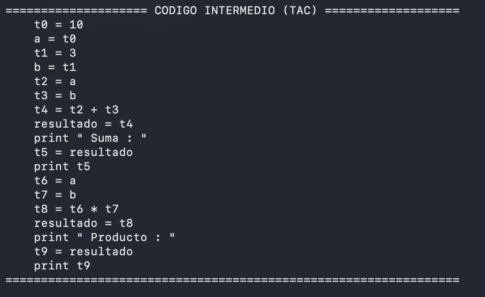
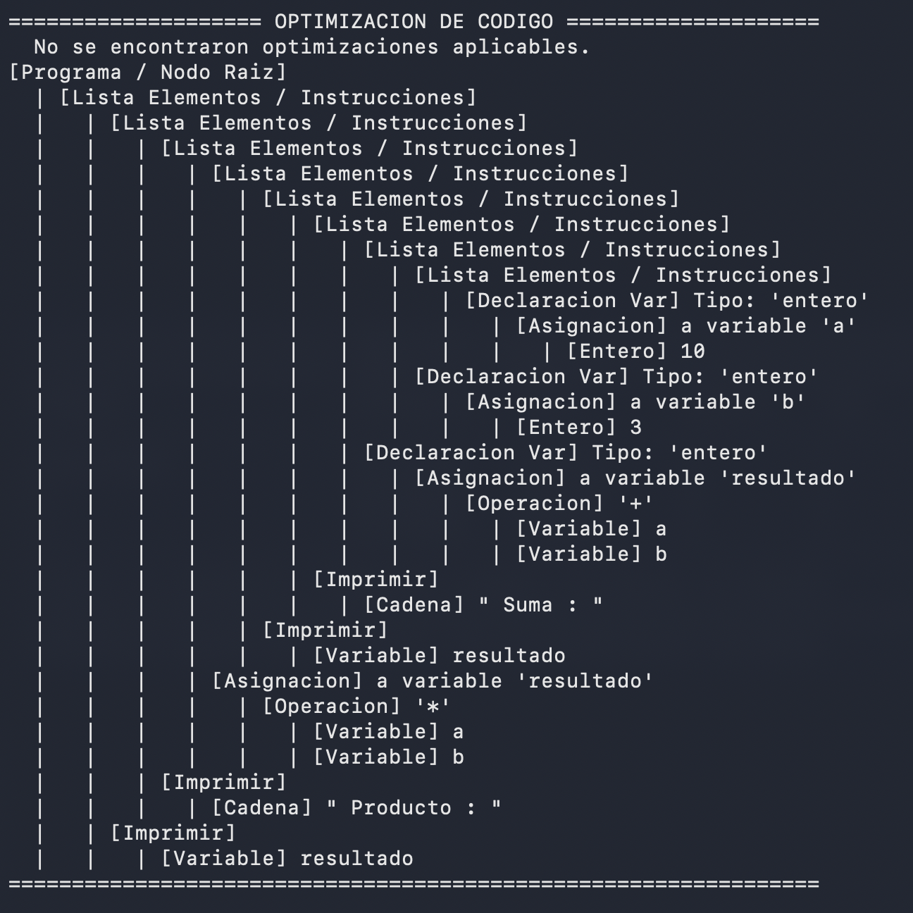

# Compilador TPP (Transpilador a RISC-V)


TPP es un compilador educativo escrito completamente en C utilizando las herramientas **Flex** (para el análisis léxico) y **Bison** (para el análisis sintáctico). Está diseñado para tomar un lenguaje de programación de alto nivel personalizado en español (con extensión `.to`) y compilarlo a código máquina **RISC-V (RV32I)**, listo para ser ejecutado en el simulador **Logisim Evolution**.

## 🚀 Características Principales

*   **Sintaxis en Español:** Palabras clave fáciles de entender (`entero`, `decimal`, `si`, `sino`, `mientras`, `para`, `fun`, `retornar`, `imprimir`, `leer`).
*   **Tipado Estático:** Soporte para variables `entero`, `decimal` y arreglos estáticos (ej. `entero arr[10];`).
*   **Control de Flujo Completo:** Bloques `si/sino`, bucle `mientras`, bucle `para` y estructura de selección múltiple `depende/caso`.
*   **Soporte para Funciones:** Declaración de funciones (procedimientos y con valor de retorno).
*   **Análisis Semántico y Optimizaciones:** Comprobación de tipos, declaración de variables, plegado de constantes algebraicas y código intermedio estructurado (TAC).
*   **Backend Funcional:** Transforma el Árbol Sintáctico Abstracto (AST) a código Ensamblador y luego a código hexadecimal compatible con memorias ROM/RAM de Logisim.

---

## 🛠️ Cómo compilar y usar el compilador

### 1. Construir el Compilador

El repositorio incluye un script en Python (`compile_to_logisim.py`) que usa el ensamblador nativo para traducir las instrucciones a los archivos `.hex` listos para ser cargados.

Asegúrate de tener instalados `flex`, `bison`, `gcc` y `make`. En la raíz del repositorio, ademas debes tener instalado Python 3 y el cross-compiler GNU para RISC-V (`riscv64-unknown-elf-gcc`). Luego, ejecuta:

```bash
python3 compile_to_logisim.py
```

Esto generará el ejecutable `./compilador` y los archivos `rom.hex` y `ram.hex`.

### 2. Compilar un programa fuente (`.to`)

Para compilar un código de prueba, pásalo como argumento al compilador:

```bash
./compilador test/prueba01.to
```

Si el programa es correcto, el compilador generará la tabla de símbolos y el archivo ensamblador resultante (`output.s`).



---

## 🖥️ Enlace con Logisim Evolution (Fork RISC-V)

Para poder ejecutar tu código compilado en el procesador virtual RISC-V construido en Logisim, es necesario pasar el ensamblador a formato crudo en hexadecimal.

### 1. Generar la imagen Hexadecimal (`.hex`)

El script `compile_to_logism.py` lee `output.s` y genera dos archivos:
*   `rom.hex`: Contiene el segmento de código (Instrucciones).
*   `ram.hex`: Contiene el segmento de datos (Variables).

### 2. Cargar el programa en Logisim

1.  Abre el circuito de tu procesador RV32I en **Logisim Evolution**.
2.  Busca el componente de la Memoria de Instrucciones (**ROM**). Haz clic derecho sobre él, selecciona **Load Image...** y escoge el archivo `rom.hex`.
3.  Repite el proceso para la Memoria de Datos (**RAM**), cargando el archivo `ram.hex`.
4.  Inicia el reloj del simulador (`Ctrl+K` o "Simulate > Auto-Tick").
5.  Observa el funcionamiento en la pantalla (Componente **TTY**) si usaste la instrucción `imprimir`.



---

## 🏗️ Fases del Compilador (Pruebas Visuales)

El compilador permite imprimir los estados intermedios del procesamiento:

**1. Árbol Sintáctico Abstracto (AST)**


**2. Análisis Semántico y Tabla de Símbolos**


**3. Generación de Código Intermedio (TAC)**


**4. Optimizador de Código**


---

### Agradecimientos

Agradecemos a nuestro estimado Ing. Manuel Apaza Valencia y al Ing. Acero, por su orientación, exigencia y enseñanzas que hicieron posible la construcción y simulación de este compilador completo.